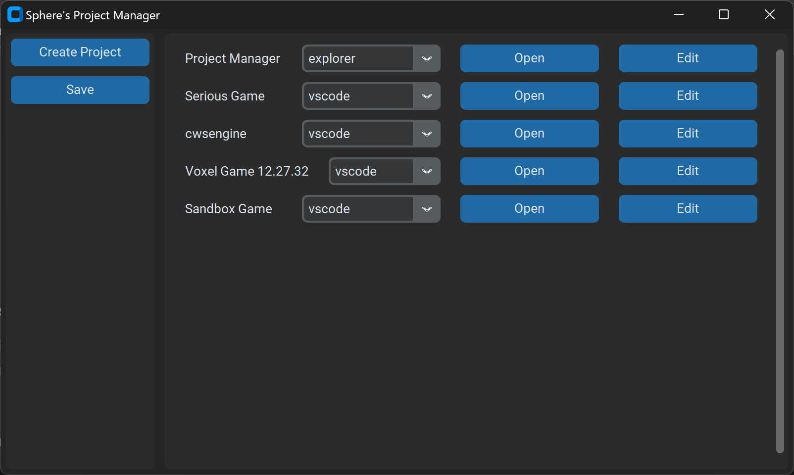

# Project Manager GUI

Simple project manager made with Custom Tkinter

### Features:
- Add, remove, and edit projects
- Open projects with terminal commands
- Interactive GUI

### Why?

I found myself losing track of my projects in a traditional file explorer. To midigate this, I created this GUI tool to easily access folders from anywhere on my machine.

### How to use

Either clone the repo, or download the precompiled exe in `dist` if you're on Windows.

If you're compiling on your own, I recommend using `pyinstaller`. Note: You must have python, tkinter, and customtkinter installed to use it.